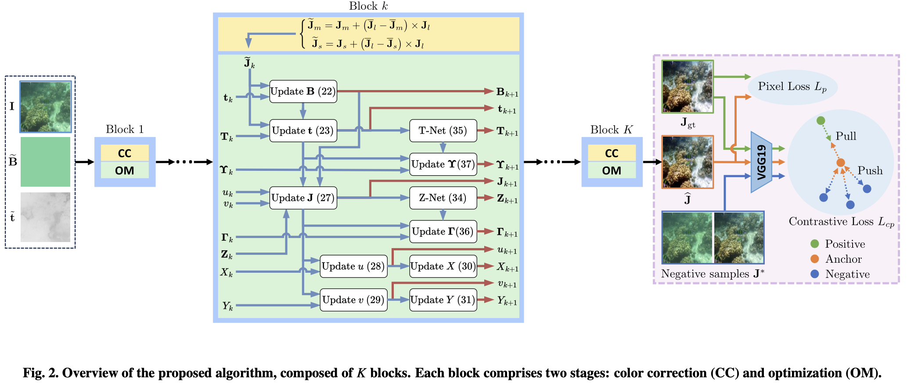

# Dual-CLUE: Dual-Channel Prior-based Deep Unfolding with Contrastive Learning for Underwater Image Enhancement

## Paper

📄 **[Read the full paper](https://www.sciencedirect.com/science/article/abs/pii/S1047320325001142?via%3Dihub)**

*Published in Journal of Visual Communication and Image Representation*

## Overview

Underwater image enhancement (UIE) techniques aim to improve the visual quality of underwater images degraded by wavelength-dependent light absorption and scattering. In this work, we propose a deep unfolding approach for UIE to leverage the advantages of both model- and learning-based approaches while overcoming their weaknesses. Specifically, we first formulate the UIE task as a joint optimization problem with physics-based priors, providing a robust theoretical foundation on the properties of underwater imaging. Then, we define implicit regularizers to compensate for modeling inaccuracies in the physics-based priors and solve the optimization using an iterative technique. Finally, we unfold the iterative algorithm into a series of interconnected blocks, where each block represents a single iteration of the algorithm. We further improve performance by employing a contrastive learning strategy that learns discriminative representations between the underwater and clean images. Experimental results demonstrate that the proposed algorithm provides better enhancement performance than state-of-the-art algorithms.



## Quick Start

### 1. Environment Setup
```bash
conda env create -f CODE/dual_clue.yml
conda activate dual_clue
```

### 2. Directory Structure
```bash
mkdir -p data/raw_images data/processed results save_path
```

### 3. Data Preparation
Place your underwater images in `data/raw_images/`, then preprocess them:

```bash
python CODE/preprocessing_data.py \
    --input_dir data/raw_images \
    --output_dir data/processed \
    --resize 256x256
```

### 4. Image Enhancement
```bash
python CODE/test.py \
    --model_dir save_path/best_model.pth \
    --test_dir data/processed \
    --output results \
    --batch_size 4
```

Enhanced images will be saved in `results/results/`.

> **Note**: You need a pre-trained model in `save_path/best_model.pth`. Contact the authors for model availability.

## Key Parameters

| Parameter | Default | Description |
|-----------|---------|-------------|
| `--resize` | 256x256 | Input image resolution |
| `--batch_size` | 4 | Processing batch size |
| `--model_dir` | save_path/best_model.pth | Pre-trained model path |

You can modify default parameters in `CODE/config.py`.

## Results

Our method demonstrates superior performance on underwater image enhancement:


Key improvements:
- Natural color restoration
- Enhanced visibility and contrast  
- Preserved structural details
- Reduced haze and color cast

## File Structure

```
data/
├── raw_images/     # Input underwater images
├── processed/      # Preprocessed data with priors
│   ├── input/      # Preprocessed images
│   ├── t_prior/    # Transmission maps
│   └── B_prior/    # Background light maps
└── results/        # Enhanced output images
```

## Citation

```bibtex
@article{pham2025dual,
  title={Dual-channel prior-based deep unfolding with contrastive learning for underwater image enhancement},
  author={Pham, Thuy Thi and Mai, Truong Thanh Nhat and Yu, Hansung and Lee, Chul},
  journal={Journal of Visual Communication and Image Representation},
  pages={104500},
  year={2025},
  publisher={Elsevier}
}
```

## Contact

For questions or issues, please open an issue in this repository or contact the authors directly.
